# Big Data : Hadoop 

## Objectif

- Mettre en place l’environnement Hadoop sous la distribution SandBox HDP en VM.
- Préparer l’environnement pour le déploiement de la distribution Cloudera de Hadoop
- Prise en main de HDFS dans d'un cluster simple noeud.
- Apprendre les commandes HDFS afin de bien gérer les fichiers sur HDFS
- Exécuter un premier traitement MapReduce (job).
- Ecrire un simple programme MapReduce en Python.
 

## 1. Installation de l’outil *Virtual Box* et déploiement de la VM *Sandbox HDP*
En général, les outils de virtualisation offrent une interface graphique pour gérer les machine virtuelles. A travers l’interface graphique, vous pouvez spécifier le nombre de CPU, la quantité de mémoire, de disque, les accès réseaux, le système d'exploitation Indiquez où se trouve l'ISO de l'OS.

### 1. Commencez par l’installation de Virtual Box [Cliquez ici](https://moodle.univ-lyon2.fr/mod/resource/view.php?id=232575)


*Oracle VM VirtualBox*, anciennement connu sous le nom de __VirtualBox__, est un logiciel libre de virtualisation créé par la société Innotek (rachetée par Sun Microsystems et aujourd’hui publié par Oracle). Il permet de créer et gérer des machines virtuelles sur un ordinateur physique. Voici les principaux concepts à connaître :

#### Machine Hôte :
La machine hôte est l’ordinateur physique qui héberge une ou plusieurs machines virtuelles.
C’est sur cette machine que vous installez VirtualBox.

En d'autre termes, on parle de votre ordinateur.

#### Système Hôte :
Le système hôte est le système d’exploitation (Windows, macOS ou Linux) installé sur la machine hôte.
Machine Invitée :
La machine invitée est la machine virtuelle qui sera allouée et gérée par VirtualBox.
Elle peut exécuter n’importe quel système d’exploitation (Windows, Linux, etc.).

Cela peut être windows si vous etes les machines de l'iut et ça peut etre aussi MacOS dans le cas d'un ordinateur Apple.

#### Système Invité :
Le système invité est le système d’exploitation installé sur la machine virtuelle.
VirtualBox prend en charge divers systèmes invités, tels qu’IBM OS/2 Warp, Linux, Windows, etc.

Dans notre cas, ici on va déployer *Hortonworks Data Platform (HDP)*

---

### Hortonworks Data Platform (HDP):

C'est une distribution Hadoop open-source riche en sécurité et prête pour l'entreprise, basée sur une architecture centralisée (YARN). Hortonworks Sandbox est un cluster à nœud unique et peut être exécuté en tant que conteneur Docker installé sur une machine virtuelle. HDP est un système complet de traitement et de stockage de données volumineuses (big data).

Il s'agit d'une architecture ouverte utilisée pour stocker et traiter des données complexes et à grande échelle. Il est composé de nombreux projets de l'Apache Software Foundation (ASF), dont __Apache Hadoop__, et est conçu spécifiquement pour répondre aux exigences des entreprises. Hortonworks était une société indépendante jusqu'en 2019, date à laquelle elle a fusionné avec Cloudera. Aujourd'hui, Hortonworks est une filiale de Cloudera, Inc.


#### Exigences en matière de matériel

- Mémoire dédiée au cluster (Minimum : 4 GiB, Recommandé : 8+ GiB). Plus c'est mieux.
- CPU (Minimum : 4 Cores, Recommandé : 6+ Cores)
    - La virtualisation doit être activée
        - (Vérifiez la virtualisation sous Windows, sous Linux : lscpu). Elle est parfois désactivée dans le BIOS. __Appellez le prof sinon__
- Stockage (*Dans l'idéal*)
    - 25-35 GiB
        - pour HDP 2.5.0
    - 65-75 GiB
        - pour HDP 2.6.5
    - 80-100 GiB
        - pour HDP 3.0.1

### 2. Installation de HDP Sandbox

#### 2.1. Téléchargement de 

Vous trouverez les liens de téléchargement de l'Environnement de travail au format .ova en fonction de l'hyperviseur choisi. Si vous utilisez VirtualBox, le téléchargement se fait ici. Ci-dessous le liens de téléchargement de la version 2.6.5 de [HDP Sandbox](https://archive.cloudera.com/hwx-sandbox/hdp/hdp-2.6.5/HDP_2.6.5_vmware_180622.ova).

#### 2.2. Installation de l'Environnement de travail

Tout d'abord, vous devez vous assurer que vous avez installé VirtualBox et qu'il est prêt à créer des VMs.

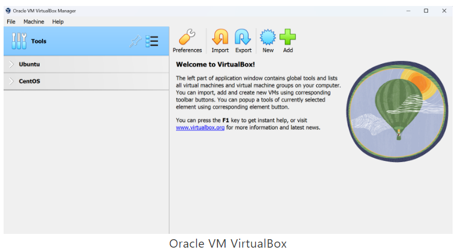

Sélectionnez ``Fichier`` dans la barre d'outils supérieure, puis choisissez ``Importer`` une appliance... dans la liste déroulante ou appuyez sur ``Ctrl+I``. La fenêtre suivante apparaît et vous permet de spécifier le fichier à partir duquel vous souhaitez importer l'appliance virtuelle. Ici, vous devez sélectionner le chemin d'accès de l'appliance virtuelle. L'appliance virtuelle porte l'extension ``.ova``.


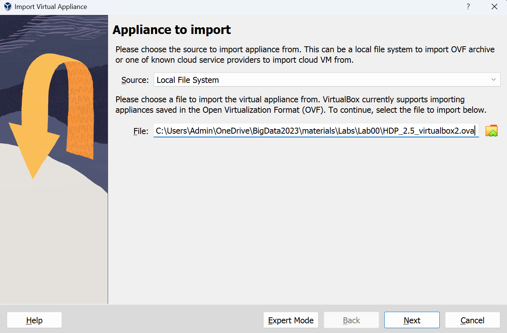

Dans la fenêtre suivante, vous devrez peut-être modifier certains paramètres. Veillez à régler les cœurs du processeur sur 4 et la taille de la mémoire vive sur 4 Go au minimum, et idéalement 8 Go pour les ordianateur performant.

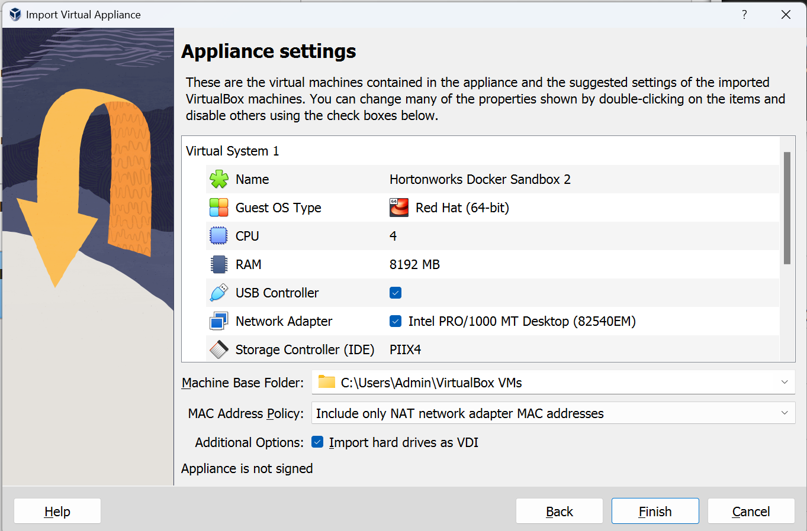

#### 2.3. Exécution de la VM

Le premier démarrage de HDP Sandbox prend beaucoup de temps, soyez patient et attendez qu'il se termine. En fait, pendant ce temps, la machine virtuelle construit l'image Docker et commence à exécuter un conteneur pour votre cluster auquel vous pouvez accéder depuis la machine hôte.

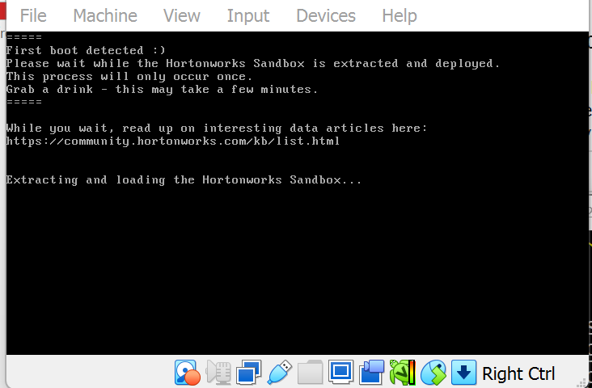

Une fois le processus d'extraction terminé, le système s'exécute comme indiqué ci-dessous.

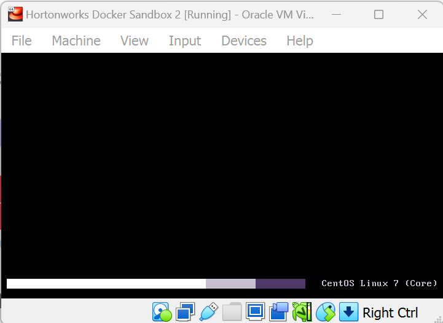

Une fois l'opération de démarrage terminée, vous verrez l'écran suivant qui donne l'adresse pour accéder à la page d'accueil de la plateforme à l'adresse http://loaclhost:1080 ou http://127.0.0.1:1080 pour HDP 2.6.5.

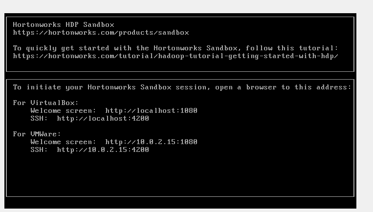

Si vous obtenez cet affichage alors l'installation est maintenant terminée et vous êtes prêt à accéder au cluster.


## 2. Accéder au cluster HDP Sandbox

Le cluster HDP Sandbox installé est une implémentation de HDP sur un seul nœud. Vous pouvez accéder à la page web de démarrage du cluster via http://localhost:1080 pour HDP 2.6.5

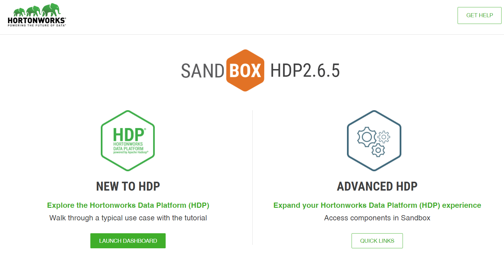

The button ``Quick Links`` will transfer you to the page of links where you can access some services of the cluster.

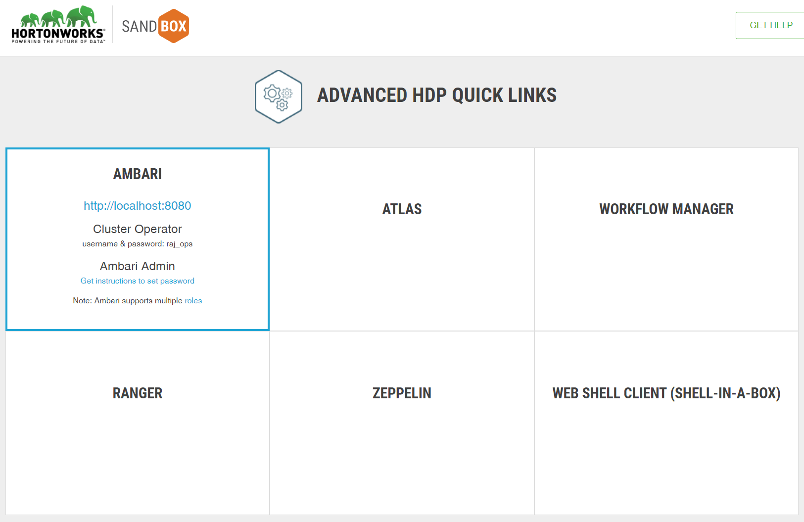

Pour voir tous les services du cluster, vous devez accéder au service Ambari à l'adresse http://localhost:8080 où vous pouvez surveiller et gérer tous les services.

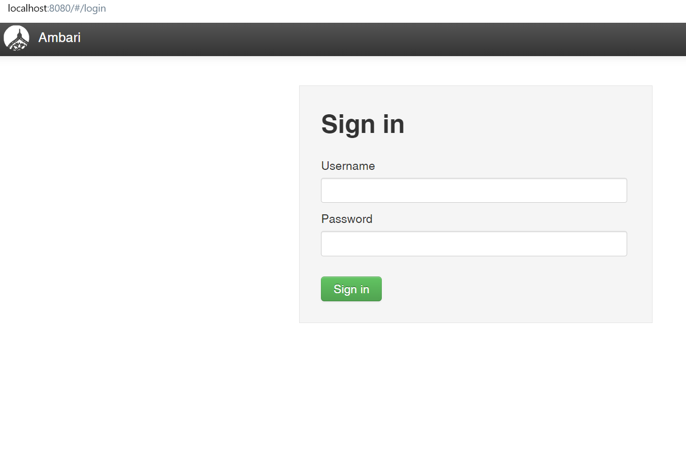
Vous devez vous connecter pour accéder à ce service. Vous pouvez utiliser les informations d'identification de l'utilisateur ``maria_dev/maria_dev`` ou bien ``raj_ops/raj_ops`` comme (username/passowrd). HDP Sandbox est livré avec 4 utilisateurs par défaut avec différents rôles dans le cluster et il y a aussi Ambari Admin qui peut gérer les autres utilisateurs dans le cluster.

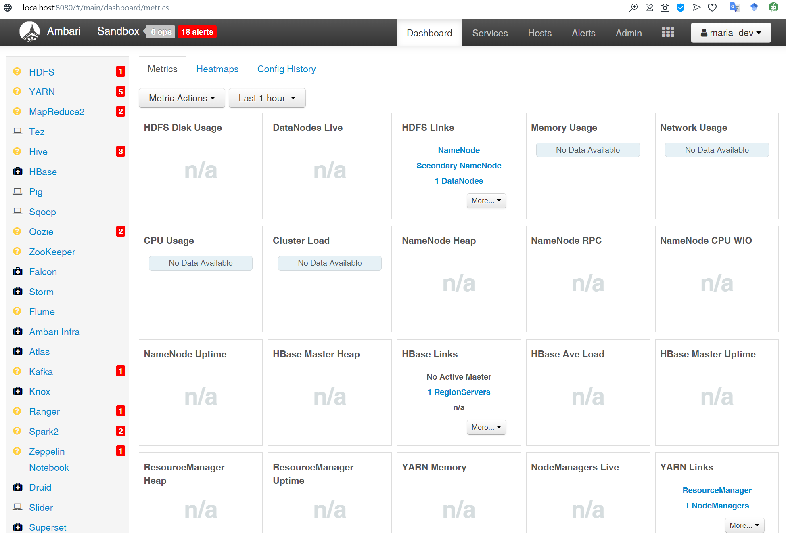


Comme vous pouvez le voir sur la page d'accueil d'Ambari, la plupart des services affichent des alertes car ils n'ont pas encore démarré ou en raison de problèmes. Vous devez attendre que les services démarrent pour pouvoir y accéder. Si vous avez défini moins de ressources que nécessaire, il est probable que la plupart des services ne peuvent pas être exécutés, vous pouvez donc arrêter les services qui ne sont pas nécessaires pour laisser les services nécessaires s'exécuter.

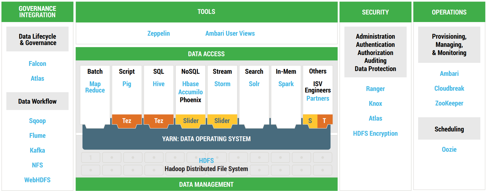

> Pour une meilleure efficacité, il serait judicieux d'arreter tout les service sauf HDFS, YARN et MapReduce2


### Access via SSH 

Il est aussi possible d'utiliser un acces en SSH pour utiliser la SandBox et pour se faire il y a principalement deux façon:

#### Par votre navigateur

Vous pouvez accéder au cluster via le client web shell ou appelé shell-in-a-box en suivant l'adresse http://localhost:4200 dans votre navigateur.

#### Par le terminal de commandes

Vous pouvez également accéder au cluster via la commande ssh sur votre terminal préféré (Touches ``Windows+R`` puis taper ``cmd``) . Vous devez vous connecter au port 2222 en tant qu'utilisateur root :

```js
ssh maria_dev@localhost -p 2222
```
ou 

```js
ssh raj_ops@localhost -p 2222
```

Si la connexion ssh n'est pas possible depui votre terminal de commande windows, faites appel au prof pour envisager une autre solution grace à *Putty*.


## 3. HDFS

Dans cette partie, il vous est conseiller de vous documenter sur les commandes linux qui permettent la :

- Navigation, création, copie, déplacement, suppression des repértoires
- Création, modification, copie, déplacement, suppression des fichiers
- et les commandes de bases

### 3.1. Prise en main Commandes HDFS
- ``hadoop fs`` : cette commande affiche la liste des commandes supportées par HDFS (Vous pouvez utiliser la commande ``hdfs dfs``, les deux commandes sont équivalente).

    - Quelle est la difference ?


- Pour connaitre la version de hadoop, la commande est :
``hadoop version`` (ou ``hdfs version``)
    - Quelle est la version hadoop de sandbox 2.6.5?

- Toutes les commande ont le format : ``hdfs dfs -COMMANDE`` (resp. ``hadoop fs -COMMANDE``).
- Les noms de commandes et leurs fonctionnalités ressemblent à celles du shell Uinx.

- Pour afficher de l’aide d’une commande donnée : ``hadoop fs -help COMMANDE``
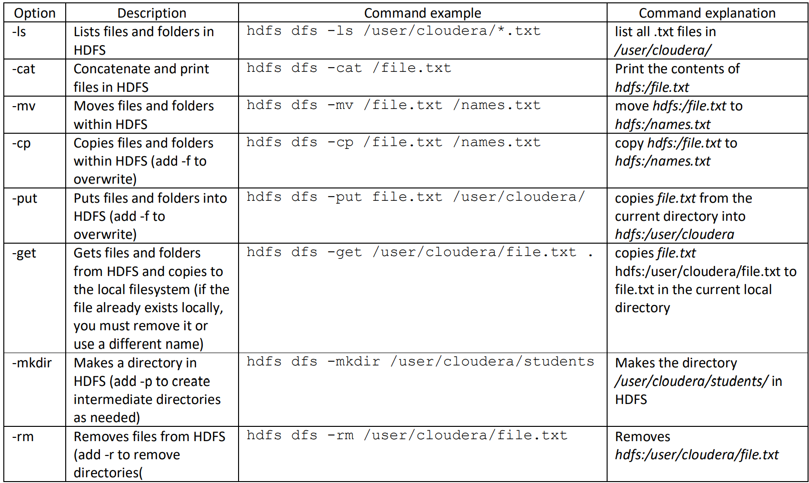


### 3.2. Importer et exporter des données
- ``hdfs dfs -ls`` : liste l'ensemble des fichiers du répertoire utilisateur HDFS.
    - Quel est le résultat obtenu? Commentez!

- ``hdfs dfs -ls /``  : affiche ce qu’il y a à la racine HDFS. 
    - Quel est la commande pour lire le contenue de ``/user``?

- Que ce passe-il si vous refaite toute les commandes précedentes avec ``hadoop fs`` au lieux de ``hdfs dfs``?

- Créez localement un fichier texte _monfichier.txt_, modifiez son contenu, sauvegardez et quittez

    - Sachant que vous êtes en ligne de commande décrivez ce que vous avez fait 

- Copiez ce fichier sur HDFS par ``hdfs dfs -put monfichier.txt.`` Utilisez hdfs dfs -ls -R pour vérifier.

- Une autre commande permet aussi d’envoyer une copie de vos données sur HDFS est :

```js
hdfs dfs -copyFromLocal monfichier.txt
```

- Si vous voulez envoyer vos données vers HDFS sans garder une copie en local :

    - Quel est la commande a effectuer 
```js 
hdfs dfs -... monfichier.txt
```

### 3.3. Manipulation des données dans HDFS

- Affichez le contenu du fichier créer mais sur HDFS

    - Completez la commande ci-dessous:
``` js
hdfs dfs -cat ...
```
- Pour les fichiers longs, vous pouvez faire ``hdfs dfs -cat monfichier.txt | less`` ou ``hdfs dfs -cat bonjour.txt | more``

- Supprimer un fichier depuis le système de fichiers HDFS :
    - Completez la commande ci-dessous
``
hadoop fs .. monfichier.txt
``

- Pour créer les répertoires du chemin 1 puis chemin2, … etc.
```
hdfs dfs -mkdir CHEMIN1 CHEMIN2 … 
```

- Créez localement un dossier nommé data et envoyez-le sur HDFS.
- Copiez le fichier monfichier.txt dans le répertoire data à l’aide de la commande -cp (vérifiez).
- Créez un dossier datasets dans le dossier data, puis déplacez monfichier.txt dans datasets à l’aide de la commande -mv, décrivez vos commandes.


- Créer une copie de monfichier.txt dans le répertoire data sous le nom copiedemonfichier.txt.

- Avant de lancer cette commande, il faut vérifier que l’espace local disponible est suffisant pour recevoir les données HDFS, décrivez vos commandes.

- Si on veut supprimer un répertoire depuis le système de fichiers HDFS 
    - Quelle est la commande à executer?


- Une commande qui vous permet de voir « l’état de santé » de votre HDFS (elle vérifie les incohérences : blocks manquants, nom de réplicas insufusants,…) :
``hdfs fsck /user``
    - Décrivez le résultat obtenu

### 3.4. Manipulation de fichiers télécharger depuis un serveur

- A partir de la VM, téléchargez les données disponibles sur le site :
> https://files.grouplens.org/datasets/movielens/ml-1m.zip


- Pour ce faire il vous faut la commande ``wget``. Si il y'a une erreur va apparaitre, décrivez comment vous avez pu faire pour télécharger le fichier.(Commentez la raison pour laqeulle l'erreur a lieu)

- Décompressez le fichier zip

Le fichier rating.dat contient plus d’un million d’évaluations anonymes d'environ 3 900 films réalisé par 6 040 utilisateurs de MovieLens (voir le README pour plus de détails).

- Créez un répértoire ``/datasets/movies`` en local et sur hdfs

- Déroulez les étapes de création des deux dossier ``/datasets/movies`` et la copie du fichier _rating.dat_ à partir du système local vers HDFS (dans movies).

 - Affichez combien de blocs occupe le fichier avec la commande 
``hdfs fsck [chemin vers votre fichier] -files -blocks`` (Commentez!)


- Pour voir la décomposition d’un fichier en plusieurs blocs, récupérez le fichier zip __MovieLens 25M Dataset__.

    - Récuperez le fichiers qui se trouve:

>https://files.grouplens.org/datasets/movielens/ml-25m.zip

- Décompressez-le puis copiez le fichier __ratings.csv__ dans un autre répertoire dans HDFS et trouver le nombre de blocs occupé par ce dernier.

### 3.5. Fichiers de configuration HDFS
Tous les fichiers de configuration d'Hadoop sont disponibles dans le répertoire ``/etc/hadoop/conf``.

Le fichier ``/etc/hadoop/conf/hdfs-site.xml ``contient les paramètres spécifiques au système de fichiers HDFS.

- Consultez le contenu de ce fichier. 
    - Quelle est la valeur du paramètre _dfs.replication_. Ce dernier permet de préciser le nombre de réplication d'un block sur les noeuds d’un cluster. Justifiez !
    
    - Vous pouvez afficher la valeur de réplication directement par la commande :
>                        hdfs getconf -confkey dfs.replication

- La taille du bloc : HDFS stocke les fichiers dans le cluster en les décomposant en blocs de taille fixe. 
    - Quelle est la taille du bloc sur votre HDFS ?

- On peut afficher la taille du bloc directement par une commande:
    - Completez la commande ci-dessous:    
>                        hdfs getconf ....

- Vous pouvez changer la taille du bloc pour un fichier par la commande :

>                        hdfs dfs -D dfs.blocksize=67108864 -put Monfichier

-  Vérifiez en envoyant un fichier sur HDFS et commenter votre analyse. (__hint__: Je vous demande de faire les manipulations pour voir le nombres des blocs)

## 4. Hadoop


Installation de MRJob, Python, Nano dans notre cluster Hadoop pour exécuter notre premier job MapReduce dans notre HDP Sandbox. 

Nous partons sur l'hypothèse que vous utilisez la version 2.6.5 de Hadoop ; si ce n'est pas le cas, voyez avec le charger de cours.

### 4.1. Préparation de la vm (MrJob, Python ...)

#### 4.1.1. Mise à jour de la SandBox HDP

La sandbox vient en une mise à jour outdate et on doit mettre la mettre à jour pou qu'on puisse récuperer des version de python à jour.

Tout d'abord, il faut executer les commande suivante: 

```js
yum-config-manager --save --setopt=HDP-SOLR-2.6-100.skip_if_unavailable=true

yum install https://repo.ius.io/ius-release-el7.rpm https://dl.fedoraproject.org/pub/epel/epel-release-latest-7.noarch.rpm
```

> Vous allez probablement vous rendre compte que ce n'est pas possible de faire l'installation car vous êtes authentifier en tant que utilisateur ``maria_dev`` qui n'a pas les droits administrateur. Pour pouvoir faire l'installation il vous faut changer d'utilisateur vers le root. Pour cela la commande ``sudo su root`` vous bascule en _root_

#### 4.1.2. Installation de python-pip: 

```js
yum install python-pip
```

#### 4.1.3. Instalation de de MrJob


MrJob est le moyen le plus simple d'écrire des programmes Python qui s'exécutent sur Hadoop. Si vous utilisez mrjob, vous pourrez tester votre code localement sans installer Hadoop ou l'exécuter sur le cluster de votre choix.

Voici un certain nombre de fonctionnalités de mrjob qui facilitent l'écriture de travaux MapReduce :

- Conserver tout le code MapReduce pour un travail dans une seule classe
- Télécharger et installer facilement les dépendances de code et de données au moment de l'exécution.
Changer les formats d'entrée et de sortie avec une seule ligne de code
- Télécharger et analyser automatiquement les journaux d'erreurs pour les traçages Python
- Placer des filtres de ligne de commande avant ou après votre code Python

Si vous ne voulez pas être un expert Hadoop mais que vous avez besoin de la puissance de calcul de MapReduce, mrjob est peut-être ce qu'il vous faut en tant que futur diplomé en Science des données.


```js
pip install pathlib
pip install mrjob==0.7.4
pip install PyYAML==5.4.1
```


#### 4.1.4. Instalation de NANO 

```js
yum install nano
```


### 4.2. Execution du MapReduce en local

> Pensez à basculer vers l'utilisateur ``maria_dev`` avec la commande ``su``

#### 4.2.1. Récuperation du code  et des données

- Commentez les deux commandes suivantes: 

```js
wget https://github.com/juba-agoun/iut-hadoop/raw/main/filmEvaluation.py


wget https://github.com/juba-agoun/iut-hadoop/raw/main/evaluation.data
```

- Si il y'a une erreur va apparaitre, décrivez comment vous avez pu faire pour télécharger le fichier.(Commentez la raison pour laqeulle l'erreur a lieu)


Afin de vérifier si votre program en map reduce est bien fait, il est conseiller de faire le test en local.

La commande qui permet de le faire est la suivant:
```js
python <nomdevotrefichier>.py <vosdonnées>.<data|csv|txt>
```

### 4.3. Execution du MapReduce sur Hadoop


    python filmEvaluation.py -r hadoop --hadoop-streaming-jar /usr/hdp/current/hadoop-mapreduce-client/hadoop-streaming.jar hdfs:///user/maria_dev/<votre-repertoire>/eval.data


- Commentez ! (__hint__: Pensez à regarder le contenue du fichier python!)


